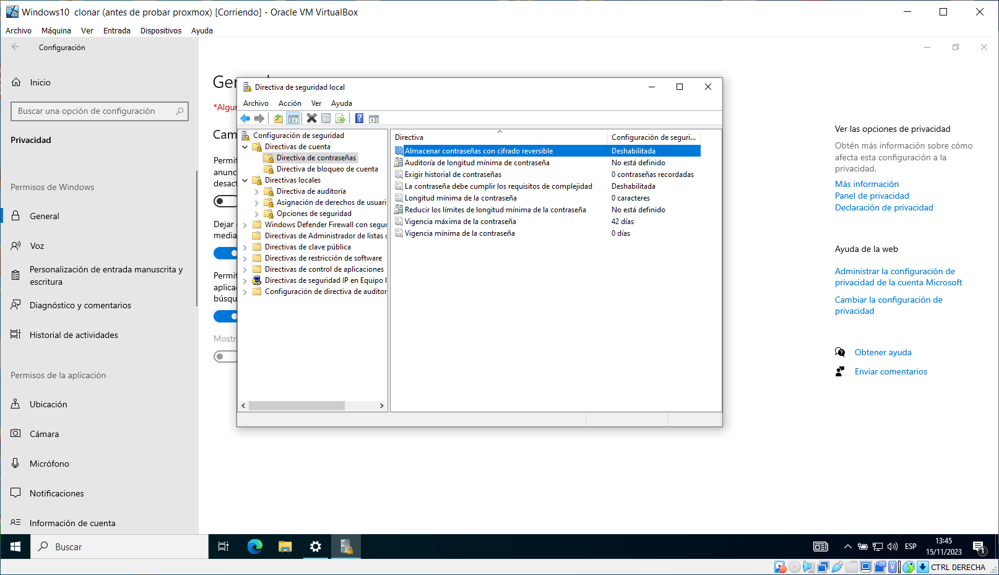
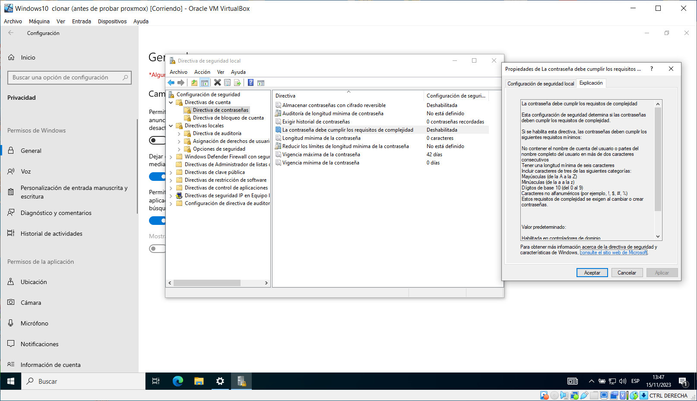
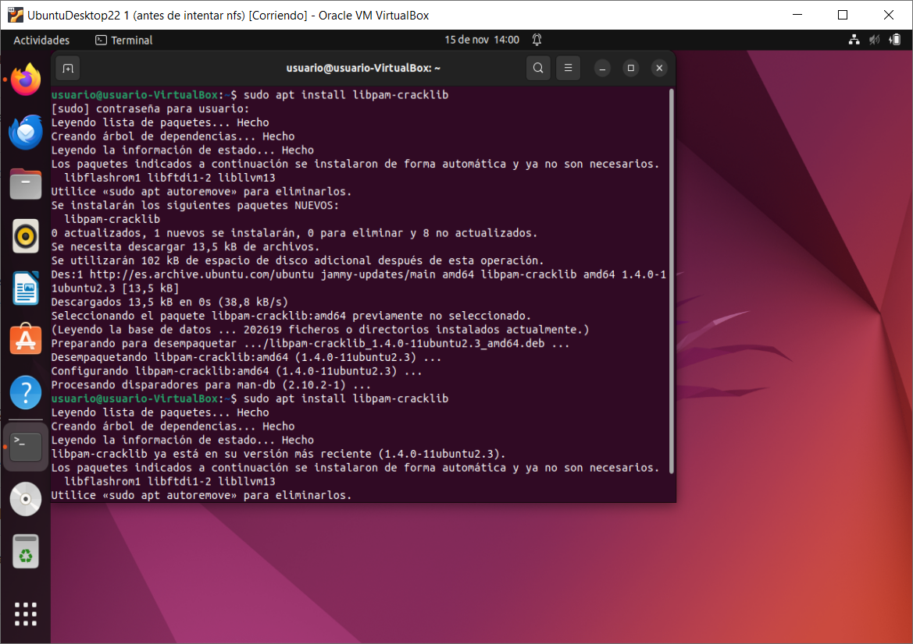
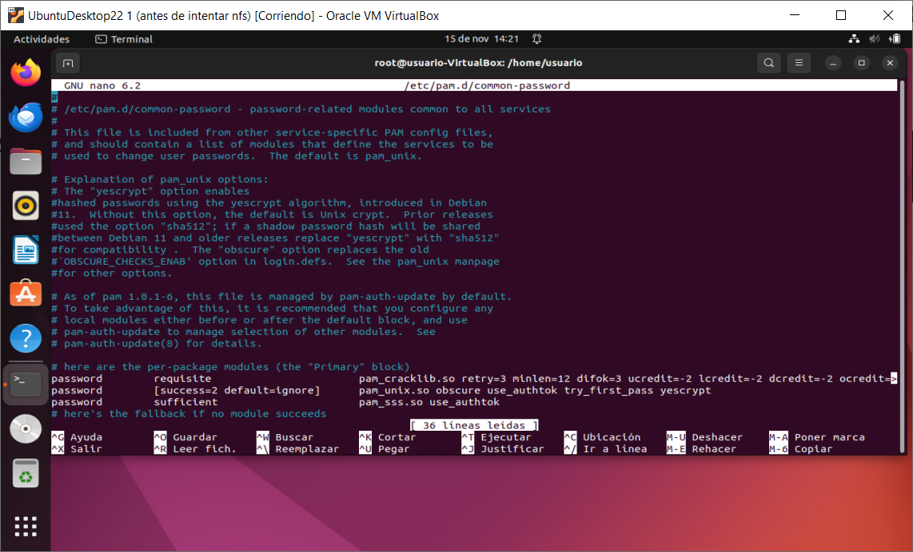
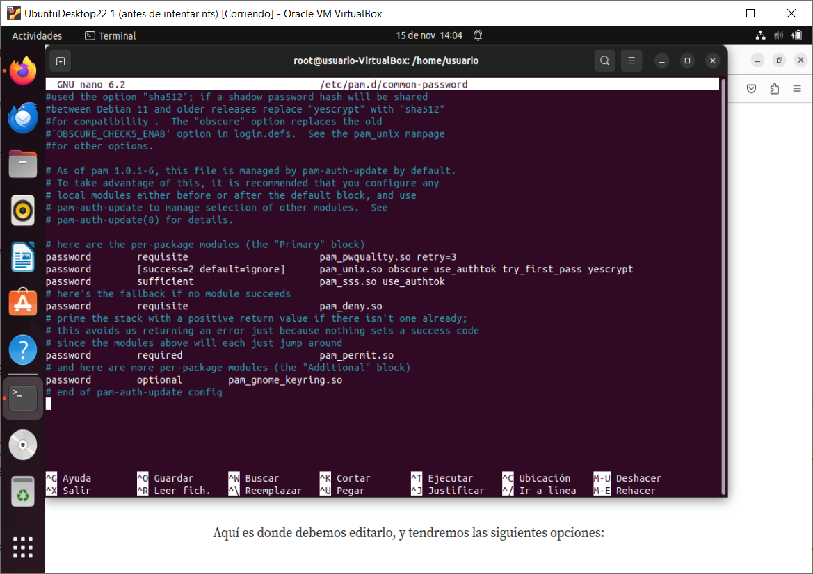
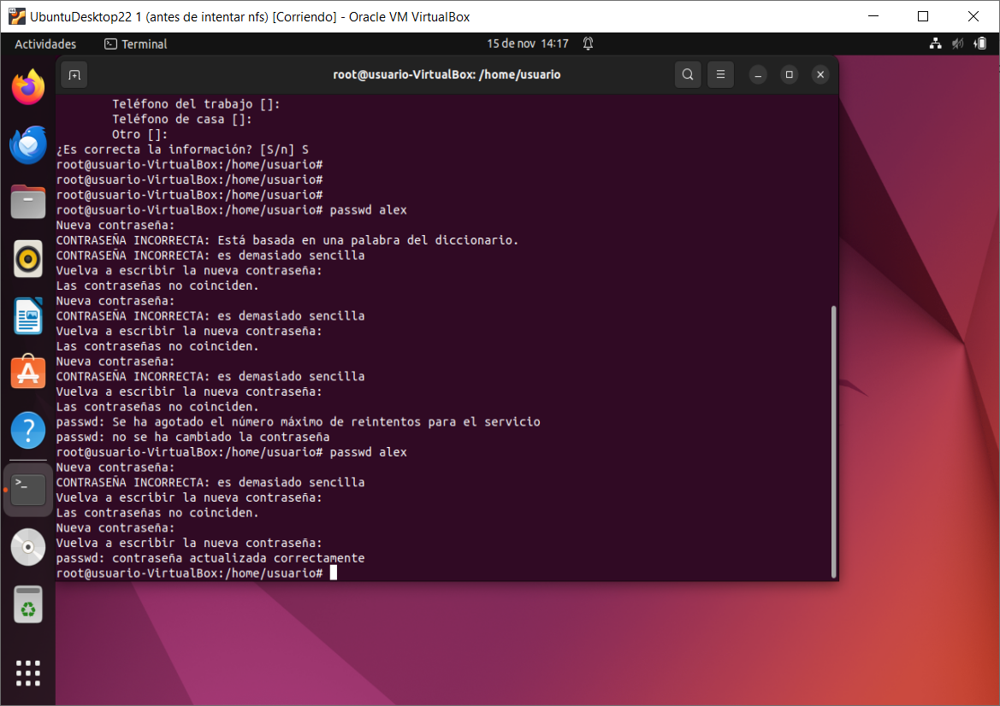
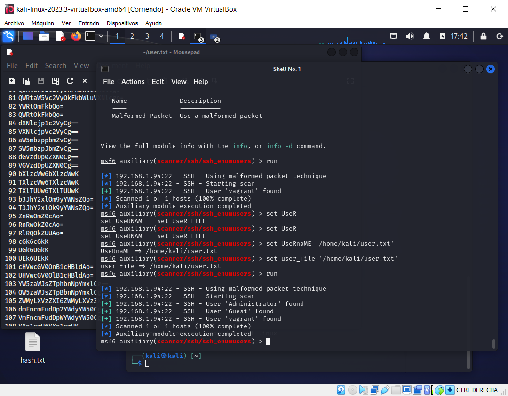
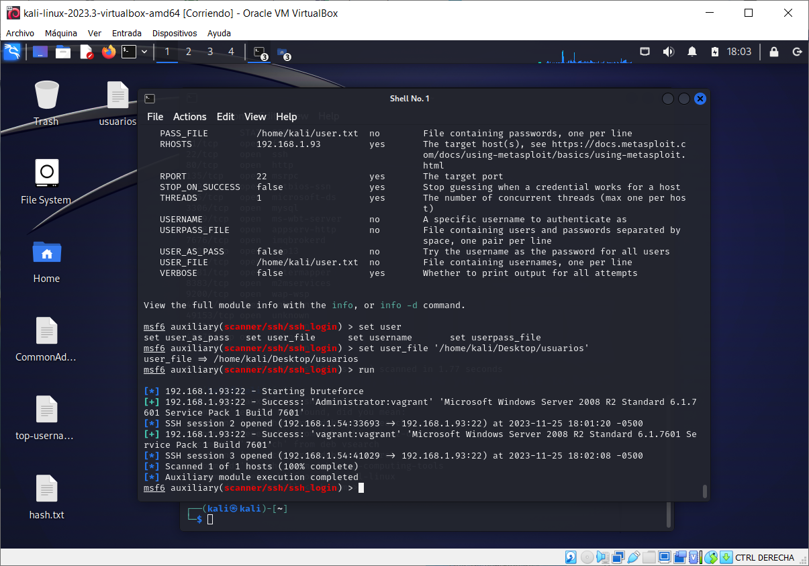
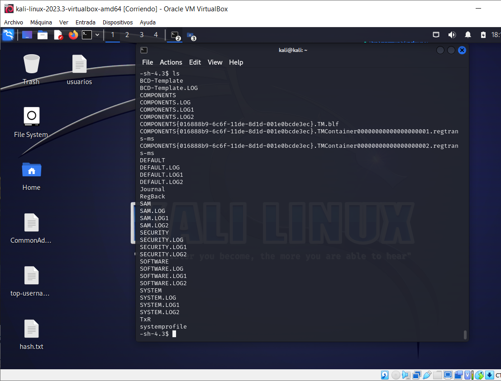
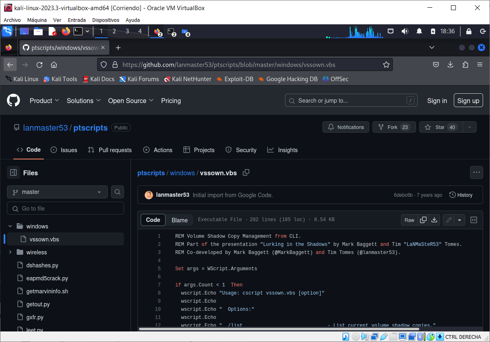

# Actividad 1.- Búsqueda de Información

## John The Ripper
Es un programa de criptografía que aplica fuerza bruta para descifrar contraseñas. Es capaz de romper varios algoritmos de cifrado o hash, como DES, SHA-1 y otros. Es una herramienta de seguridad muy popular, ya que permite a los administradores de sistemas comprobar que las contraseñas de los usuarios son suficientemente buenas. John the Ripper es capaz de autodetectar el tipo de cifrado de entre muchos disponibles, y se puede personalizar su algoritmo de prueba de contraseñas. Eso ha hecho que sea uno de los más usados en este campo.
- Descarga: [John The Ripper](https://www.openwall.com/john/)
- Guía: [GitHub - John The Ripper](https://github.com/openwall/john)

## Hiren's BootCD PE (entorno de preinstalación)
Es una edición restaurada de Hiren's BootCD basada en Windows 10 PE x64. Dado que no hay actualizaciones oficiales después de noviembre de 2012, los fanáticos de Hiren's BootCD están desarrollando la versión PE. Contiene la menor cantidad de herramientas gratuitas, pero las mejores. Está siendo desarrollado para computadoras de la nueva era, admite arranque UEFI y requiere un mínimo de 2 GB de RAM.
- Descarga: [Hiren's BootCD PE](https://www.hirensbootcd.org/download/)
- Guía: [Hiren's BootCD How-Tos](https://www.hirensbootcd.org/howtos/)


# Actividad 2.- Configuración de Contraseñas Seguras en Windows y Linux
-Nos dirigimos a directivas de seguridad local de hay podemos dirigirnos a Directivas d e cuenta > Directivas de contraseñas

-En este aprtado podremos habilitar parametros para que los usuarios que conecten a la terminal deban hacer uso de contraseñas mas complejas no puedan reutilizar la misma contraseña cuando se les solicite cambiar la contarseña, tambien se puede controlar el timepo de vigencia de la contraseña junto con la longitud

 
 

-Para llevar a cabo las politicas de seguridad en ubuntu, primero debemos realizar la instalacion del programa libpam-cracklib

-Mediante la orden `sudo apt install libpam-cracklib`


-Despues procedemos a acceder al archivo common-password donde añadiremos los siguientes parametros para configurar el tipo de contraseña que exigiremos a nuestros usuarios.



-retry: Número de intentos antes de que el sistema devuelva un error.\
-minlen: Longitud mínima de contraseña.\
-difok: Cambios de caracteres que debe tener la nueva contraseña en comparación con la vieja.\
-ucredit: Caracteres en mayúscula que debe tener.\
-lcredit: Caracteres en minúscula que debe tener.\
-dcredit: El número de dígitos que debe tener la nueva contraseña.\
-ocredit: El número de dígitos que debe tener la contraseña.\
-Las opciones ucredit, lcredit,dcredit y ocredit pueden tener números negativos o positivos, por ejemplo:\

-ucredit=-3 : Significa que como mínimo debe tener 3 caracteres en mayúscula.\
-ucredit=+3 : Significa que como máximo debe tener 3 caracteres en mayúscula.\


-Añadimos la siguiente linea 

`password requisite pam_cracklib.so retry=3 minlen=12 difok=3 ucredit=-2 lcredit=-2 dcredit=-2 ocredit=-2`



-Estas directivas nos daran recomendaciones para la contraseña de acuerdo a los parametros que hallamos introducido, hasta que el aviso desaparezca, pero si se insiste en introducir una contraseña que no cumpla las directivas establecidas se pueden hacer repitiendo dicha contraseña continuamente.



# Actividad 3- Ataques contra contraseñas en Sistemas Windows – FICHERO SAM

-Para obtener las contraseñas mediante rainbowtables usando rainbowcrack, primero debemos descargarnos la aplicación de sus pagina web: (http://project-rainbowcrack.com/) gracias a esta aplicación podremos crear nuestras propias rainbow tables, las cuales nos servirán para desencriptar las contraseñas, pero antes de crear las tablas debemos saber que tipo de codificación tienen, para ello haremos uso de la herramienta hash identifier la cual nos dice que están encriptadas en md5.

-Ahora debemos crear las tablas podemos descargarlas de paginas web como (http://project-rainbowcrack.com/)., o creandolas usando la orden rtgen seguido del sistema de encriptación md5, los caracteres que puede contener la contraseña alpha numeric sigue la longitud de la contraseña minimo y maximo que va regido de acuerdo a los caracteres que hayas introducido, el índice, el tamaño de la cadena, el número de cadenas ha generar y por ultimo el parámetro para dividir las cadenas en archivos más cortos. Quedando la orden de esta manera:

rtgen md5 loweralpha-numeric 1 7 0 3800 33554432 0

-Una vez creada la tabla procedemos a ordenarlas con la orden rtsort . o rtsort *.rt para ordenar todas las rainbowtables dentro de directorio.
Por último usaremos la orden rcrack seguido del directorio de las rainbowtbles -h y la cadena hash que queremos descifrar.

rcrack -h hash

# Actividad 4- Ataques contra contraseñas en Sistemas Windows

- Realizamos una inspección de los puertos abiertos mediante `nmap` y encontramos que el puerto SSH está abierto. Procedemos a realizar un ataque de fuerza bruta con diccionarios para averiguar el usuario y la contraseña.
  
  
- Accedemos a la carpeta `system32` y luego a `config`, donde encontramos los archivos SAM y SYSTEM. Introducimos un script llamado `vssown.vbs` para generar una unidad virtual con estos dos archivos.
  
  
  
    
- Usamos la orden `scp` para copiar desde esta unidad virtual los archivos SAM y SYSTEM a nuestro equipo.

- En nuestro equipo, desciframos las contraseñas con diccionarios como `rockyou` o `kaonashi`.


# Actividad 5.- Ataques contra contraseñas en Sistemas Linux

- Realizamos el mismo ataque que en la actividad 3 para acceder a una máquina Ubuntu.
- Hacemos un `cat` a los archivos `shadow` y `passwd`, y juntamos ambos archivos con la orden `unshadow`, creando un archivo combinado.
- Pasamos este archivo por John The Ripper para obtener nuevas contraseñas y acceder al objetivo con otras cuentas.


# Actividad 6.- Realiza un listado de Congeladores este tipo de herramientas y analiza la instalación y configuración de 2 congeladores

Para congelar la sesión de inicio de una máquina y que esta no guarde ningún cambio realizado por el usuario, podemos hacer uso de diversas herramientas. En este caso, se han utilizado Shadow Defender y Deep Freeze.

- **Shadow Defender:** Se puede descargar desde su [sitio web](http://www.shadowdefender.com/). Permite "congelar" unidades dentro del sistema y hacer que todos los cambios que haga el usuario se pierdan una vez se apague la computadora.

- **Deep Freeze:** Lleva a cabo la "congelación" de todo el equipo sin hacer distinciones entre distintas unidades.


# Actividad 7: GRUB
## a) Protege con contraseña el GRUB, para que no se pueda ejecutar secuencia de comandos, como root, en el arranque.
## b) Protege contraseña el arranque de los sistemas operativos.

Para llevar a cabo la securización del Grub, debemos loguearnos en el sistema en el que queramos realizar la operación y dirigirnos al archivo `00_header` ubicado en `/etc/grub.d/`. Una vez en el archivo, debemos introducir las siguientes líneas:
```bash
cat << EOF
set superusers="root,usuario"
password root 1111
password usuario 2222
EOF


